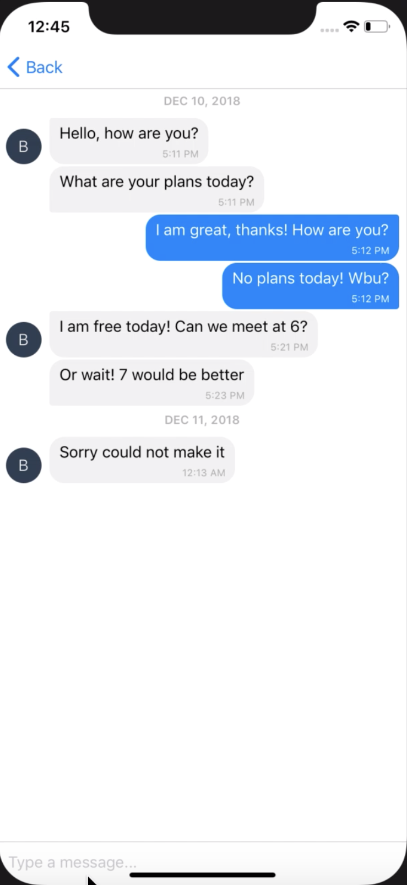

# Client-Side Implementation of Secchat.Me
> A end-to-end encrypted Messaging System





## Design
### Client Design


## API Documentation

### Cryptographic Functions
- encryptMsg()

```javascript
// crypt.js

module.exports = function(app) {
  export function encryptMsg(msg) {
    // initialize RSA object with public key
    var public_key_rsa = forge.pki.publicKeyFromPem(rsa_keypair.pub);
    msg = forge.util.encodeUtf8(msg);

    // generate AES key and IV
    var aes_key = forge.random.getBytesSync(32);
    var hmac_key = forge.random.getBytesSync(32);
    var iv = forge.random.getBytesSync(16);

    var aes_ciphertext = encryptAES(iv, aes_key, msg);
    var tag = runHMAC(hmac_key, aes_ciphertext);
    
    final_key = aes_key + hmac_key;
    var encrypted_key = public_key_rsa.encrypt(final_key, 'RSA-OAEP');

    return data = {
        "iv" : iv,
        "keys" : encrypted_key,
        "cipher" : aes_ciphertext,
        "tag" : tag
    }
}
```

encryptMsg() returns a JSON object containing all necessary information the receiver needs to decrypt the message.

> NOTE: RSA public keys of receivers have to be obtained in person. Digitally sending public keys does NOT ensure confidentiallity. Doing so leads to vulnerability to Man in the Middle attacks.

- decryptMsg()

```javascript
// crypt.js

export function decryptMsg(data) {
    var private_key_rsa = forge.pki.privateKeyFromPem(rsa_keypair.priv);
    var decrypted_keys = private_key_rsa.decrypt(data.keys, 'RSA-OAEP');

    var iv = data.iv;
    var aes_key = decrypted_keys.slice(0, 32);
    var hmac_key = decrypted_keys.slice(32);

    var tag = runHMAC(hmac_key, data.cipher);
    if(tag === data.tag) { 
        console.log("HMAC tags matched! Continue decryption...");
    } else {
        console.log("HMAC tags don't match!");
        return "###THIS IS A SYSTEM MESSAGE:\n HMAC tags did not match! Message may be corrupted!\n ###END MESSAGE";
    }

    // returning plaintext
    return decryptAES(iv, aes_key, data.cipher);
}
```

A JSON object data is provided. It has the following attributes.
```
{
    iv: String,
    keys: String,
    cipher: String,
    tag: String
}
```


